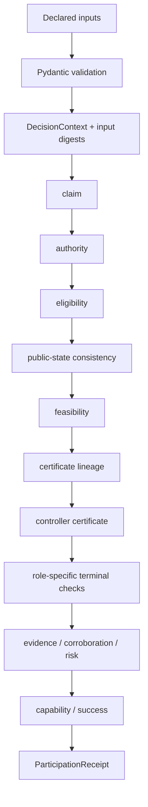

# Architecture

CLPG is a small deterministic kernel:

```text
declared records
  -> validation
  -> canonical JSON and input digests
  -> ordered evaluator pipeline
  -> ParticipationReceipt
  -> optional LedgerRecord
```

## Evaluator Pipeline



Each evaluator is a small module with one public `evaluate_*` function. This keeps the implementation easier to audit and easier to port to another language.

## Strict Inputs

Strict mode requires:

- a canonical `ClaimSnapshot`;
- a certified service envelope;
- a public coordination state;
- an ambient action model and feasibility mask;
- digest lineage from service certificates to derived certificates;
- a controller certificate or operational sketch digest with a nonempty safe policy set;
- an audited participation interface;
- authority identity/certificate binding;
- evidence, uncertainty, attribution, and budget records;
- optional stabilizability/corroboration summaries when policy requires them.

## Core Boundaries

The core package has no network, LLM, database, or cloud dependency. All decisions are functions of declared records and policy thresholds.

The implementation intentionally does not import sibling projects. Future integrations should adapt their receipts into CLPG input models rather than becoming runtime dependencies.
